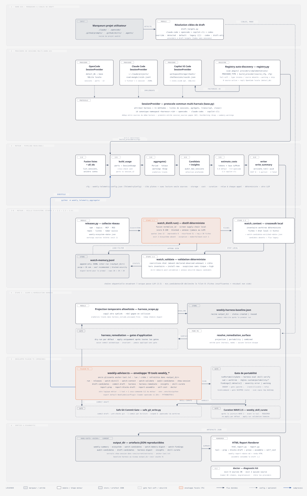

# weekly-advisor-kit

Revue hebdomadaire automatisée de vos agents de code : analyse de la télémétrie locale, veille écosystème, audit des sessions coûteuses et rapport HTML interactif, avec un moteur 100 % déterministe, zéro LLM pour les chiffres.

[](https://github.com/BenjaminCartonAdeo/weekly-advisor-kit/actions/workflows/ci.yml)
[](.opencode/plugins/weekly-advisor-engine)
[](LICENSE)



## Ce que fait le kit

Chaque lundi, le kit produit un rapport unique qui répond à vos questions : combien vous avez dépensé, ce qui a coûté cher et pourquoi, quels skills et commands sont inutilisés ou redondants, quoi surveiller dans l'écosystème, et quelles corrections peuvent être auto-rédigées (proposées, jamais imposées).

Le cœur est 100 % déterministe : le moteur Python lit directement la télémétrie locale des harnais actifs (base SQLite OpenCode, transcripts JSONL Claude Code, sessions Copilot VS Code) et produit des JSON reproductibles, sans SDK ni serveur. Le LLM n'intervient que sur les étapes qualitatives, encadrées par des skills dédiés et des contrats anti-hallucination. Le pipeline complet (8 étapes, de la télémétrie au rapport final) est décrit dans la [spécification](doc/spec-opencode-weekly-advisor).

## Fonctionnalités clés

| Fonctionnalité | Ce que vous obtenez |
|---|---|
| Multi-harnais | Télémétrie OpenCode, Claude Code et Copilot VS Code via `session_sources`, extensible par source ; **Codex n'est jamais un provider de télémétrie** — cible de drafting seule (`.agents/`) |
| Chiffres déterministes | Moteur Python pur, zéro LLM sur les données : coûts, tokens, cache, outliers, prompts répétés |
| Coûts estimés | Estimation par session avec surcharge `cost_rate_usd_per_mtok` par source, alertes budget semaine/mois |
| Audit qualité | Sessions candidates auditées par skill dédié, constats archivés avec baseline pour mesurer la dérive |
| Veille marché | Distillation hebdomadaire (~30 fiches scorées) confrontée à votre environnement, avec mémoire inter-run |
| Auto-drafting mono-cible | Drafts skills/commands ciblés vers le harnais du projet, gate de portabilité avant commit (erreur → refus) |
| Curation WAVE 2.5 | Manifeste déterministe des actions de curation/TTL en **dry-run** ; gate politique : `apply=true` n'exécute que les **archives** (déplacement idempotent, jamais de suppression), les autres actions restent des propositions |
| Gouvernance observation-only | Dérive d'architecture/configuration **observée** (projection watch-context + finding insights `architecture-drift`) : jamais bloquante, ne déclenche ni curation ni application |
| Rapport web final | HTML autonome (dashboard KPI, filtres, dark mode) ouvert automatiquement en fin de run, plus archive MD |

## Installation

Prérequis : `uv`, Python ≥ 3.11, `opencode` ≥ 1.18 avec un modèle authentifié (`opencode auth login`), `harness-eval` ≥ 7.9.0 pour l'étape 5. Détails et alternatives : [`INSTALL.md`](INSTALL.md).

```sh
git clone https://github.com/BenjaminCartonAdeo/weekly-advisor-kit.git && cd weekly-advisor-kit
uv sync --project .opencode/plugins/weekly-advisor-engine --extra dev
```

> **Piège connu** : `--extra dev` est obligatoire. Sans lui, `pytest` et `ruff` ne sont pas installés et la validation locale échoue.

## Quickstart

1. **Adaptez la configuration** : `project_root` et `output_dir` (chemins absolus) dans [`.opencode/plugins/weekly-advisor-engine/weekly-telemetry-config.json`](.opencode/plugins/weekly-advisor-engine/weekly-telemetry-config.json).
2. **Vérifiez le poste** : `opencode run --agent weekly-advisor "Exécute weekly_doctor et donne son verdict"`. Sortie attendue : un verdict base, config et binaires, sans erreur.
3. **Lancez la revue** : `opencode run --agent weekly-advisor "Lance la revue hebdomadaire"`. Comptez environ 8 à 12 minutes (orchestration parallèle en waves) ; à la fin le rapport HTML s'ouvre dans votre navigateur.

Résultat visible : `reports/html/weekly-report-latest.html` (rapport HTML autonome) et `reports/runs/current/weekly-report-<date>.md` (archive MD).

## Usage

**Revue manuelle complète** : après le quickstart, relancez la commande de l'étape 3 chaque fois que vous voulez un état frais. Le run est orchestré en **waves parallèles de subagents** (branches télémétrie, veille et harnais exécutées en parallèle, puis drafting/insights/cohérence), écrit un JSON daté par étape dans le répertoire du run, puis assemble le rapport. Un récapitulatif des durées par branche est écrit dans `weekly-timings-<date>.json`. Un run partiel renvoie le code 1 (warnings tolérés), un run fatal le code 2, sans rapport.

**Planning hebdomadaire (cron)** :

```cron
0 6 * * 1 opencode run --port 4096 --agent weekly-advisor --model <votre-modèle> --dir /chemin/du/kit "Lance la revue hebdomadaire" >> /var/log/weekly-advisor.log 2>&1
```

Le rapport final est le signal du cron : s'il est absent, quelque chose s'est mal passé. Pour un cron headless, désactivez l'ouverture navigateur avec `WEEKLY_NO_BROWSER=1` ou `open_browser: false` dans la config. Détails et heartbeat recommandé : [`INSTALL.md`](INSTALL.md) §2.7.

## Configuration

Les clés principales vivent dans [`weekly-telemetry-config.json`](.opencode/plugins/weekly-advisor-engine/weekly-telemetry-config.json) :

| Clé | Rôle | Défaut |
|---|---|---|
| `session_sources` | Sources de télémétrie actives (opencode, claude-code, copilot-vscode…) | opencode |
| `draft_targets` | Harnais cible du drafting (auto par marqueurs projet, ou liste) | auto |
| `output_dir` | Répertoire des runs et archives | `~/opencode-weekly-reviews` |
| `cost_rate_usd_per_mtok` | Taux de coût par source (surcharge) | par modèle |
| `lookback_days` | Fenêtre analysée par run | 7 |

Le détail des clés, des seuils et des invariants est dans la [spécification](doc/spec-opencode-weekly-advisor) et [`INSTALL.md`](INSTALL.md) §2.3. En interne, la configuration est exposée en **vues groupées** (sources, stockage, coûts, curation) — vues en lecture seule **rétro-compatibles** : le fichier JSON garde ses clés plates historiques, aucune migration requise.

## Contributing

Contributions bienvenues, en particulier : nouveaux providers de harnais, règles de portabilité, diagrammes et corrections de documentation.

Validation locale (depuis le dossier moteur `.opencode/plugins/weekly-advisor-engine`) :

```sh
uv run python -m pytest -q    # 594 tests
uv run ruff check .           # lint
uv run ruff format --check .  # format
```

Gate docs ↔ code (depuis la racine du repo, node requis) :

```sh
node scripts/check-flow-docs.mjs   # G1 : comptes de tests cohérents + contrats de flux
```

Le CI (`.github/workflows/ci.yml`) répète lint, format, 594 tests, packaging et smoke test du plugin sur Ubuntu et Windows, puis la gate G1. Commits en [Conventional Commits](https://www.conventionalcommits.org/) (`feat:`, `fix:`, `docs:`…). La spécification vit dans [`doc/spec-opencode-weekly-advisor`](doc/spec-opencode-weekly-advisor), l'architecture dans [`doc/ARCHITECTURE.md`](doc/ARCHITECTURE.md), l'installation pas à pas dans [`INSTALL.md`](INSTALL.md).

### WAVE 2.5 — manifeste de curation (dry-run)

Après la jointure de WAVE 2 (donc après `weekly-coherence-review`), le pipeline exécute
`weekly_skill_curate` et écrit `skill-curate-<date>.json` dans `runs/current/`. Ce manifeste
déterministe liste les actions proposées (`archive`, `merge`, `pin`, `reference`), leurs
cibles et leur statut. **Par défaut, c'est un dry-run (gate no-apply) : aucun fichier n'est déplacé,
fusionné, supprimé ou modifié.** Une application nécessite une validation humaine explicite
et un appel avec `apply=true`. **Gate politique** : même en `apply`, seule l'action
`archive` est exécutée (déplacement idempotent vers `_archive/<date>/`, jamais de
suppression) ; `merge`, `reference`, `pin`, `delete` et `recalibrate` restent des
propositions, sans aucune opération fichiers. Les éléments `origin=user` restent protégés.
WAVE 2.5 est séquentielle et précède le tail de génération du rapport ; elle est
**REQUIRED** à l'assemble : si les findings de cohérence portent des actions de curation
mais que le manifeste `skill-curate-<date>.json` est absent, le rapport passe en P0 avec
rc=1 (partiel).

## Documentation

| Document | Contenu |
|---|---|
| [`doc/spec-opencode-weekly-advisor`](doc/spec-opencode-weekly-advisor) | Spécification fonctionnelle : le contrat complet du pipeline |
| [`doc/ARCHITECTURE.md`](doc/ARCHITECTURE.md) | Architecture du kit et du pipeline |
| [`INSTALL.md`](INSTALL.md) | Installation pas à pas, cron, mise à jour, dépannage |
| [`INSTALL_PROMPT.md`](INSTALL_PROMPT.md) | Installation pilotée par agent (à coller dans une session OpenCode) |
| [`doc/diagrams/`](doc/diagrams/) | Schémas d'architecture et séquences |

## Limites

- Le moteur lit les tables internes de la base SQLite d'opencode : ce n'est pas une API publique, une mise à jour majeure peut rompre la collecte jusqu'à la mise à jour du kit. `weekly_doctor` diagnostique.
- La veille dépend d'APIs publiques (npm, GitHub, registre MCP) : rate-limits possibles, warnings tolérés, le run continue.
- L'exploration d'architecture via Graphify (`graphify-out/`) est **hors pipeline** : out-of-band et optionnelle, elle ne nourrit ni la revue ni le rapport, et ses sorties sont ignorées par le kit. Une mise à jour de graphe seule (code-only) peut s'exécuter sans LLM. État courant : graphe brut `graph.json` — 2766 nœuds · 7032 liens, construit au commit `6b1117d`. Un **résumé d'architecture filtré** peut être projeté en lecture seule (`scripts/graphify-architecture-summary.py`) : 2744 nœuds · 6937 arêtes · 99 fichiers (19 nœuds génériques exclus). Le filtrage exclut les nœuds sans fichier source, les nœuds génériques et les sources disparues (`stale`) ; liens restreints aux nœuds retenus, self-loops omis, collections triées (sortie reproductible). Le graphe n'est jamais modifié et la projection n'entre ni dans la revue ni dans le rapport.

## Licence

[MIT](LICENSE) © Benjamin CARTON
